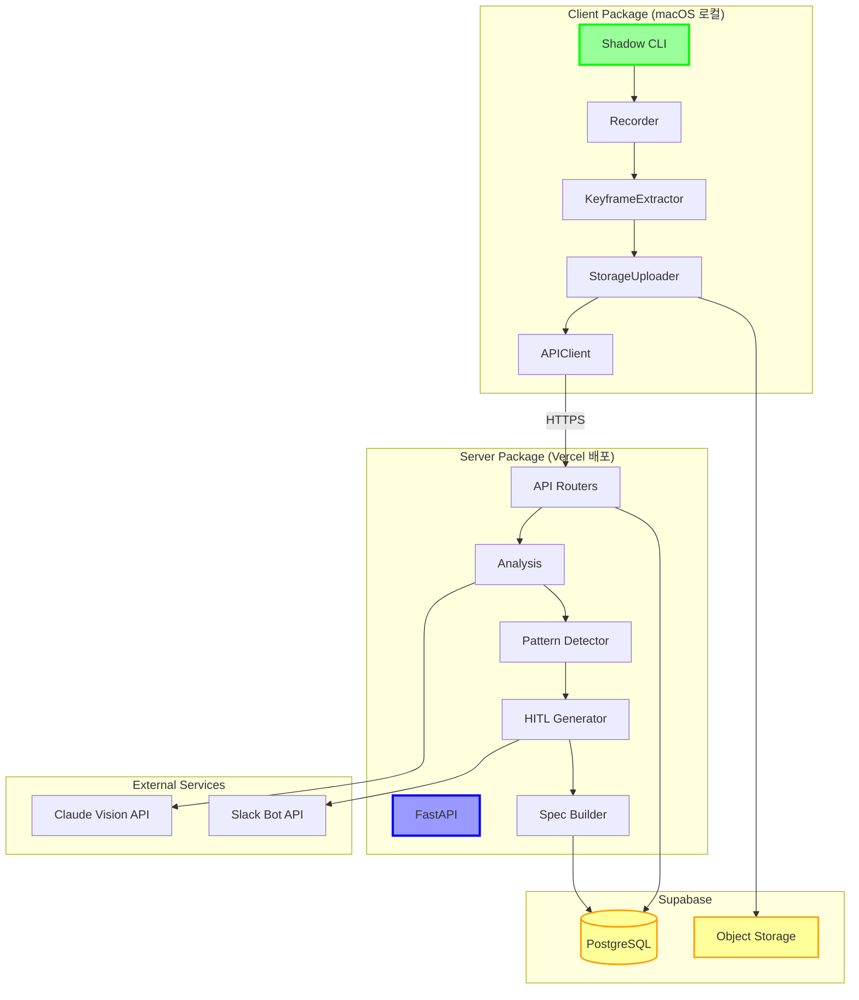
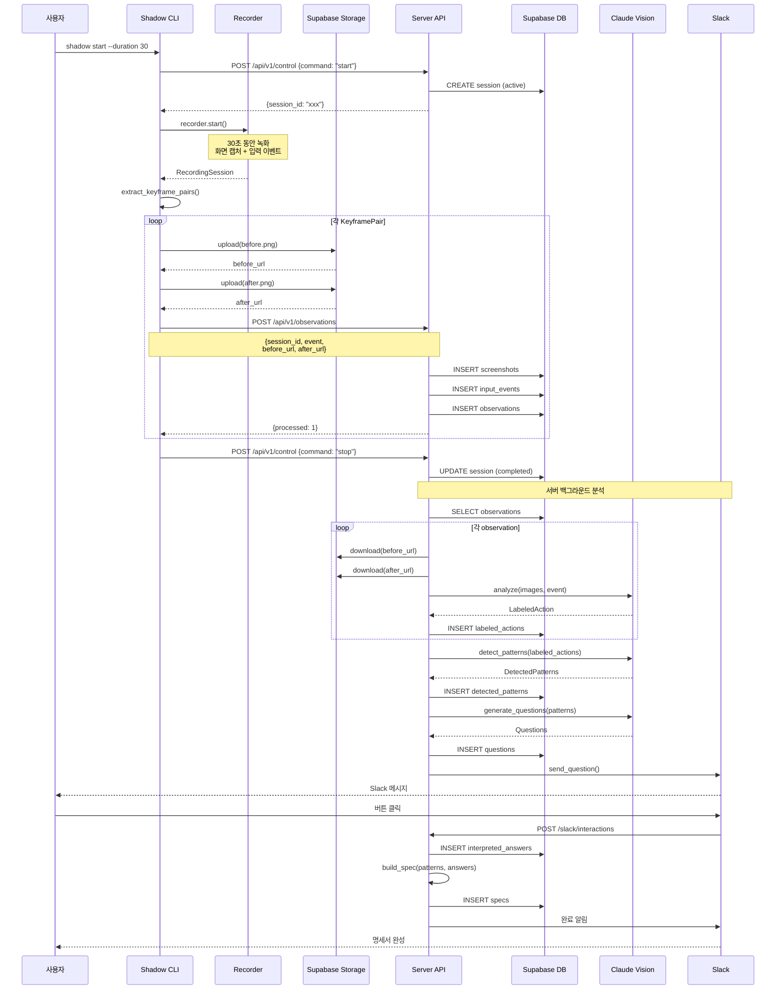
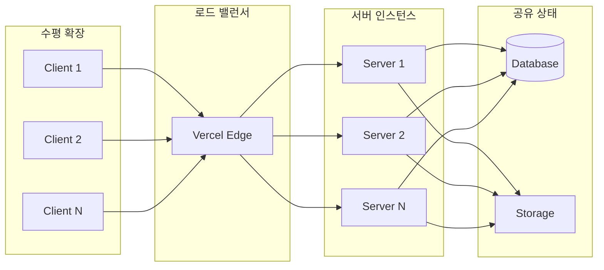

# Shadow 아키텍처 분석 및 개선 방향

**작성일: 2026-02-04**
**상태: 분석 완료**

---

## 📋 목차

1. [현재 문제 상황](#현재-문제-상황)
2. [클라이언트-서버 혼재의 의미](#클라이언트-서버-혼재의-의미)
3. [개발 히스토리 분석](#개발-히스토리-분석)
4. [개선된 아키텍처 설계](#개선된-아키텍처-설계)
5. [핵심 설계 원칙](#핵심-설계-원칙)
6. [마이그레이션 계획](#마이그레이션-계획)

---

## 현재 문제 상황

### 문제 요약

Shadow 프로젝트의 `main.py`에는 **클라이언트 역할**(로컬 녹화)과 **서버 역할**(API 제공)이 한 곳에 혼재되어 있어, 클라우드 배포가 불가능하고 역할이 불명확한 상태입니다.

### 구체적 문제점

#### 1️⃣ 배포 불가능

```bash
# Vercel/Replit에 배포 시도 시
❌ ERROR: pyobjc-framework-Cocoa는 macOS에서만 설치 가능
❌ ERROR: mss는 GUI 환경이 필요합니다
❌ ERROR: pynput은 X11/Wayland 디스플레이가 필요합니다
```

**원인**: `main.py`가 OS 의존적 라이브러리를 직접 import

```python
# main.py:24
from shadow.capture.recorder import Recorder, RecordingSession
# → Recorder는 내부적으로 mss, pynput, PyObjC 사용
```

#### 2️⃣ 역할 혼재

`main.py`가 두 가지 상충되는 역할을 동시 수행:

| 엔드포인트 | 역할 | 실행 환경 | 문제점 |
|-----------|------|----------|--------|
| `/recording/start` | 로컬 녹화 시작 | macOS 전용 | 서버에서 실행 불가 |
| `/recording/stop` | 로컬 녹화 중지 | macOS 전용 | 서버에서 실행 불가 |
| `/analyze` | 로컬 데이터 분석 | 로컬 파일 의존 | 인메모리 상태 관리 |
| `/api/v1/*` | DB 기반 API | OS 독립적 | 제대로 된 아키텍처 ✅ |

**모순**: 같은 FastAPI 앱에서 로컬 녹화와 클라우드 API를 동시 제공

#### 3️⃣ 의존성 비대화

```toml
# pyproject.toml - 모든 의존성이 한 곳에
[project]
dependencies = [
    # 클라이언트만 필요 (OS 의존적)
    "mss>=9.0.0",
    "pynput>=1.7.0",
    "pyobjc-framework-Cocoa>=10.3.1",
    "pyobjc-framework-Quartz>=10.3.1",

    # 서버만 필요 (AI/DB)
    "anthropic>=0.40.0",
    "supabase>=2.0.0",

    # 공통
    "fastapi>=0.128.0",
    "pillow>=10.0.0",
]
```

**문제**:
- 서버 배포 시 불필요한 클라이언트 의존성 설치 시도 → 실패
- 클라이언트 실행 시 불필요한 서버 의존성 설치 → 용량 낭비

#### 4️⃣ 중복된 아키텍처

```python
# 방식 1: 구식 (로컬 전용, 인메모리)
POST /recording/start → state.recorder = Recorder() → AppState
POST /analyze → state.labels = analyzer.analyze()
GET /labels → state.labels 반환

# 방식 2: 신식 (DB 기반, 확장 가능) ✅
POST /api/v1/control {"command": "start"} → DB INSERT sessions
POST /api/v1/observations → DB INSERT observations
GET /api/v1/status → DB SELECT
```

**두 가지 방식이 공존**하여 어떤 것을 사용해야 할지 불명확

---

## 클라이언트-서버 혼재의 의미

### "혼재"란 정확히 무엇인가?

#### 클라이언트 로직 (로컬에서만 실행 가능)

```python
# shadow/capture/recorder.py
class Recorder:
    def __init__(self):
        self.sct = mss.mss()           # 화면 캡처 (GUI 필요)
        self.listener = pynput.mouse.Listener()  # 마우스 이벤트 (OS 의존)
        self.window_info = get_active_window()   # PyObjC (macOS 전용)
```

**특징**:
- OS 의존적 (macOS, Windows, Linux 각각 다른 구현)
- GUI 환경 필수
- 로컬 파일 시스템 접근
- 하드웨어 직접 제어 (마우스, 키보드, 디스플레이)

#### 서버 로직 (어디서든 실행 가능)

```python
# shadow/api/routers/agent.py
@router.post("/api/v1/observations")
async def create_observations(request: ObservationsRequest):
    # DB 저장만
    session_repo.get_session(request.session_id)
    obs_repo.create_observation(...)
```

**특징**:
- OS 독립적
- 네트워크 기반 (HTTP/DB)
- 상태를 DB에 영구 저장
- 멀티 클라이언트 지원

### 혼재의 구체적 증거

#### main.py:24-28
```python
from shadow.analysis.models import LabeledAction
from shadow.analysis.claude import ClaudeAnalyzer          # 서버 로직 ✅
from shadow.api.routers import agent_router                # 서버 로직 ✅
from shadow.capture.recorder import Recorder, RecordingSession  # 클라이언트 로직 ❌
from shadow.config import settings
```

**문제**: 서버용 main.py가 클라이언트 모듈(Recorder)을 import

#### main.py:126-150
```python
@app.post("/recording/start")
async def start_recording(request: RecordingStartRequest):
    state.recorder = Recorder(monitor=request.monitor, fps=request.fps)

    def record_task():
        state.session = state.recorder.record(request.duration)

    state.recording_thread = threading.Thread(target=record_task, daemon=True)
    state.recording_thread.start()
```

**문제**: FastAPI 서버가 직접 화면 녹화 수행 → 클라우드에서 실행 불가

---

## 개발 히스토리 분석

### 어떻게 이런 구조가 되었나?

#### Phase 1: 로컬 전용 프로토타입 (초기)

```bash
# 목표: "빠르게 프로토타입 만들기"
$ python demo.py --record 5
```

```python
# 구현
recorder = Recorder()
session = recorder.record(5)
extractor = KeyframeExtractor()
keyframes = extractor.extract(session)

# 분석
analyzer = ClaudeAnalyzer()
labels = analyzer.analyze_batch(keyframes)
```

**특징**:
- 모든 것이 로컬 파일 기반
- 단일 프로세스 실행
- CLI 스크립트 수준
- ✅ 이 단계에서는 문제 없음

#### Phase 2: API 추가 (빠른 테스트용)

```python
# "FastAPI로 감싸면 테스트하기 편하겠다"
# main.py에 엔드포인트 추가
@app.post("/recording/start")
def start_recording():
    state.recorder = Recorder()  # 로컬 Recorder 직접 호출
    state.recorder.start()
```

**문제 시작점**:
- 로컬 로직을 API로 감싸기만 함
- 클라이언트-서버 분리 없이 "편의상" 추가
- 빠른 개발을 위해 AppState (인메모리) 사용

#### Phase 3: DB 연동 (제대로 된 설계 시도)

```python
# agent_router.py 추가
@router.post("/api/v1/observations")
async def create_observations(request: ObservationsRequest):
    # Supabase DB에 저장
    session_repo.create_observation(...)
```

**의도**:
- 제대로 된 아키텍처 구축
- DB 기반 상태 관리
- 멀티 클라이언트 지원

**하지만**:
- 기존 `/recording/*` 엔드포인트는 그대로 유지
- 두 가지 방식이 공존하게 됨

#### Phase 4: 현재 상태

```
main.py
├── /recording/start (구식 - 인메모리)
├── /recording/stop
├── /analyze
└── /api/v1/*  (신식 - DB 기반) ✅
```

**결과**:
- 방식 1: 로컬 녹화 엔드포인트 (Legacy)
- 방식 2: DB 기반 API (올바른 방향)
- **하지만 둘 다 `main.py`에 존재** → 배포 불가

### 왜 분리하지 않았나?

1. **점진적 개발**: 처음부터 완벽한 설계 없이 기능 추가
2. **빠른 프로토타이핑**: "일단 동작하게" 우선
3. **리팩토링 미루기**: "나중에 정리하자" → 기술 부채 누적
4. **명확한 기준 부재**: 언제 분리해야 하는지 기준 없음

---

## 개선된 아키텍처 설계

### 전체 구조도



### 패키지 구조

```
shadow-py/
├── packages/
│   ├── client/                    # 클라이언트 패키지
│   │   ├── pyproject.toml
│   │   └── shadow_client/
│   │       ├── __init__.py
│   │       ├── capture/           # 화면 캡처 (mss, pynput)
│   │       ├── preprocessing/     # 키프레임 추출
│   │       ├── uploader.py        # Supabase Storage 업로드
│   │       ├── api_client.py      # Server API 클라이언트
│   │       └── cli.py             # CLI 진입점
│   │
│   ├── server/                    # 서버 패키지
│   │   ├── pyproject.toml
│   │   ├── vercel.json
│   │   └── shadow_server/
│   │       ├── __init__.py
│   │       ├── main.py            # FastAPI 앱
│   │       ├── api/               # API 라우터
│   │       ├── analysis/          # Vision AI 분석
│   │       ├── patterns/          # 패턴 감지
│   │       ├── hitl/              # 질문 생성
│   │       ├── spec/              # 명세서 작성
│   │       └── slack/             # Slack 연동
│   │
│   └── shared/                    # 공통 모듈
│       ├── pyproject.toml
│       └── shadow_core/
│           ├── models.py          # Pydantic 모델
│           ├── config.py          # 설정
│           ├── errors.py          # 에러 정의
│           └── storage.py         # Storage 헬퍼
│
├── docs/
├── README.md
└── .gitignore
```

### E2E 데이터 흐름



### 의존성 분리

#### Client (`packages/client/pyproject.toml`)

```toml
[project]
name = "shadow-client"
version = "0.1.0"
dependencies = [
    # 화면 캡처
    "mss>=9.0.0",
    "pynput>=1.7.0",
    "pillow>=10.0.0",

    # 윈도우 정보 (macOS)
    "pyobjc-framework-Cocoa>=10.3.1; sys_platform == 'darwin'",
    "pyobjc-framework-Quartz>=10.3.1; sys_platform == 'darwin'",

    # Storage & API
    "supabase>=2.0.0",  # Storage 업로드용
    "httpx>=0.27.0",    # Server API 호출

    # 공통 모듈
    "shadow-core",
]

[project.scripts]
shadow = "shadow_client.cli:main"
```

#### Server (`packages/server/pyproject.toml`)

```toml
[project]
name = "shadow-server"
version = "0.1.0"
dependencies = [
    # Web Framework
    "fastapi>=0.128.0",
    "uvicorn>=0.40.0",

    # AI
    "anthropic>=0.40.0",
    "openai>=1.0.0",  # NVIDIA NIM

    # Database
    "supabase>=2.0.0",

    # Integrations
    "slack-sdk>=3.39.0",

    # Utils
    "pillow>=10.0.0",  # 이미지 다운로드/처리
    "python-levenshtein>=0.26.0",  # 패턴 유사도

    # 공통 모듈
    "shadow-core",
]
```

#### Shared (`shared/pyproject.toml`)

```toml
[project]
name = "shadow-core"
version = "0.1.0"
dependencies = [
    "pydantic>=2.0.0",
    "pydantic-settings>=2.0.0",
]
```

### 핵심 구현 상세

#### 1. Client: StorageUploader

```python
# packages/client/shadow_client/uploader.py
from supabase import Client, create_client
from pathlib import Path

class StorageUploader:
    """Supabase Storage에 이미지 업로드"""

    def __init__(self, supabase_url: str, supabase_key: str):
        self.client: Client = create_client(supabase_url, supabase_key)
        self.bucket = "shadow-recordings"

    def upload_keyframe(
        self,
        session_id: str,
        observation_id: str,
        image: bytes,
        image_type: str  # "before" or "after"
    ) -> str:
        """이미지 업로드 → Public URL 반환

        Returns:
            https://.../shadow-recordings/session-xxx/obs-001_before.png
        """
        path = f"{session_id}/{observation_id}_{image_type}.png"

        self.client.storage.from_(self.bucket).upload(
            path=path,
            file=image,
            file_options={"content-type": "image/png"}
        )

        url = self.client.storage.from_(self.bucket).get_public_url(path)
        return url
```

#### 2. Client: APIClient

```python
# packages/client/shadow_client/api_client.py
import httpx
from shadow_core.models import ObservationsRequest, ObservationsResponse

class ShadowAPIClient:
    """Shadow Server API 클라이언트"""

    def __init__(self, server_url: str):
        self.base_url = server_url
        self.client = httpx.AsyncClient(base_url=server_url, timeout=30.0)

    async def start_session(self) -> str:
        """새 세션 시작

        Returns:
            session_id
        """
        response = await self.client.post(
            "/api/v1/control",
            json={"command": "start"}
        )
        response.raise_for_status()
        data = response.json()
        return data["session_id"]

    async def send_observations(
        self,
        session_id: str,
        observations: list[dict]
    ) -> ObservationsResponse:
        """관찰 데이터 전송"""
        request = ObservationsRequest(
            session_id=session_id,
            observations=observations
        )

        response = await self.client.post(
            "/api/v1/observations",
            json=request.model_dump()
        )
        response.raise_for_status()
        return ObservationsResponse(**response.json())

    async def stop_session(self, session_id: str) -> None:
        """세션 종료"""
        await self.client.post(
            "/api/v1/control",
            json={"command": "stop", "session_id": session_id}
        )
```

#### 3. Client: CLI 수정

```python
# packages/client/shadow_client/cli.py
import asyncio
from .recorder import Recorder
from .keyframe import KeyframeExtractor
from .uploader import StorageUploader
from .api_client import ShadowAPIClient
from shadow_core.config import settings

async def cmd_start(duration: float):
    """녹화 및 서버 전송"""

    # 1. 서버에 세션 시작 요청
    api_client = ShadowAPIClient(settings.server_url)
    session_id = await api_client.start_session()
    print(f"세션 시작: {session_id}")

    # 2. 로컬 녹화
    recorder = Recorder()
    recorder.start()
    await asyncio.sleep(duration)
    session = recorder.stop()

    # 3. 키프레임 추출
    extractor = KeyframeExtractor()
    pairs = extractor.extract_pairs(session)
    print(f"키프레임 쌍: {len(pairs)}개")

    # 4. Storage 업로드 및 API 전송
    uploader = StorageUploader(settings.supabase_url, settings.supabase_key)

    observations = []
    for pair in pairs:
        # 이미지 업로드
        before_url = uploader.upload_keyframe(
            session_id, pair.id, pair.before.data, "before"
        )
        after_url = uploader.upload_keyframe(
            session_id, pair.id, pair.after.data, "after"
        )

        # 관찰 데이터 생성
        observations.append({
            "id": pair.id,
            "timestamp": pair.timestamp,
            "before_screenshot": before_url,
            "after_screenshot": after_url,
            "event": pair.event.model_dump(),
            "active_window": pair.window.model_dump(),
        })

    # 5. 서버로 전송
    response = await api_client.send_observations(session_id, observations)
    print(f"전송 완료: {response.processed}개 처리됨")

    # 6. 세션 종료
    await api_client.stop_session(session_id)
    print("세션 종료")
```

#### 4. Server: main.py 정리

```python
# packages/server/shadow_server/main.py
from fastapi import FastAPI
from shadow_server.api.routers import agent_router, hitl_router, specs_router, slack_router

app = FastAPI(
    title="Shadow API",
    description="화면 녹화 분석 API",
    version="0.1.0",
)

# API 라우터만 등록
app.include_router(agent_router)   # /api/v1/*
app.include_router(hitl_router)    # /api/hitl/*
app.include_router(specs_router)   # /api/specs/*
app.include_router(slack_router)   # /slack/*

@app.get("/health")
async def health():
    return {"status": "ok"}

# ❌ 삭제된 것들:
# - from shadow.capture.recorder import Recorder
# - AppState 클래스
# - /recording/start, /recording/stop, /analyze 엔드포인트
```

#### 5. Server: 백그라운드 분석

```python
# packages/server/shadow_server/api/routers/agent.py
from fastapi import BackgroundTasks

@router.post("/api/v1/control")
async def control_system(
    request: ControlRequest,
    background_tasks: BackgroundTasks,
    db: Client = Depends(get_db)
):
    if request.command == "stop":
        session = session_repo.update_session_status(
            request.session_id, "completed"
        )

        # 백그라운드에서 분석 시작
        background_tasks.add_task(
            analyze_session_background,
            session_id=request.session_id,
            db=db
        )

        return ControlResponse(
            status="ok",
            new_state="analyzing",
            session_id=session["id"]
        )

async def analyze_session_background(session_id: str, db: Client):
    """세션 분석 (백그라운드 작업)"""

    # 1. 관찰 데이터 조회
    obs_repo = ObservationRepository(db)
    observations = obs_repo.get_observations_by_session(session_id)

    # 2. Vision AI 분석
    analyzer = ClaudeAnalyzer()
    for obs in observations:
        # Storage에서 이미지 다운로드
        before_image = download_from_url(obs.before_url)
        after_image = download_from_url(obs.after_url)

        # 분석
        labeled_action = await analyzer.analyze(before_image, after_image, obs.event)

        # DB 저장
        action_repo = LabeledActionRepository(db)
        action_repo.create(labeled_action)

    # 3. 패턴 감지
    pattern_analyzer = create_pattern_analyzer("claude")
    patterns = await pattern_analyzer.detect_patterns(session_id)

    # 4. HITL 질문 생성
    hitl_generator = HITLGenerator()
    questions = hitl_generator.generate(patterns)

    # 5. Slack 전송
    slack_client = SlackClient()
    for question in questions:
        slack_client.send_question(channel, question)
```

---

## 핵심 설계 원칙

### 1. 명확한 역할 분리

```
Client                          Server
├─ 수집 (Capture)              ├─ 처리 (Process)
├─ 전처리 (Preprocess)         ├─ 분석 (Analyze)
├─ 업로드 (Upload)             ├─ 저장 (Store)
└─ 전송 (Send)                 └─ 알림 (Notify)
```

#### Client는 하지 말아야 할 것
- ❌ Vision AI 분석 (비용/속도)
- ❌ 패턴 감지 (LLM 필요)
- ❌ DB 직접 접근 (보안)
- ❌ Slack 메시지 전송 (인증)

#### Server는 하지 말아야 할 것
- ❌ 화면 캡처 (OS 의존)
- ❌ 입력 이벤트 수집 (권한 필요)
- ❌ 로컬 파일 시스템 접근
- ❌ GUI 작업

### 2. 데이터 전송 최적화

#### 이미지 전송 방식 비교

| 방식 | 크기 | 속도 | 구현 난이도 | 선택 |
|------|------|------|------------|------|
| Base64 → API Body | 133% | 느림 | 쉬움 | ❌ |
| Storage → URL | 100% | 빠름 | 중간 | ✅ |
| 직접 전송 (multipart) | 100% | 중간 | 어려움 | ❌ |

**선택 이유**:
- Storage는 CDN 제공 (전세계 빠른 접근)
- API Payload 크기 제한 회피
- 이미지 재사용 가능 (썸네일, 분석 재시도)

### 3. 확장 가능한 구조



**핵심**:
- 서버는 Stateless (상태를 DB에만 저장)
- 인스턴스 추가로 확장 가능
- 클라이언트는 독립적으로 작동

### 4. 보안 원칙

#### API 키 관리

```
Client:
- SUPABASE_URL (public)
- SUPABASE_KEY (anon key - 읽기/쓰기 제한)
- SERVER_URL (public)

Server:
- ANTHROPIC_API_KEY (secret)
- SUPABASE_KEY (service role - 모든 권한)
- SLACK_BOT_TOKEN (secret)
- SLACK_SIGNING_SECRET (secret)
```

**원칙**:
- 비싼 API 키는 서버만 (Claude, OpenAI)
- 클라이언트는 제한된 권한만 (Supabase anon key)
- 환경 변수로 관리, 코드에 절대 포함 금지

### 5. 에러 처리 및 재시도

```python
# Client: 재시도 로직
async def send_observation_with_retry(
    api_client: ShadowAPIClient,
    observation: dict,
    max_retries: int = 3
):
    for attempt in range(max_retries):
        try:
            await api_client.send_observations([observation])
            return
        except httpx.HTTPError as e:
            if attempt == max_retries - 1:
                # 로컬에 저장 (나중에 재전송)
                save_failed_observation(observation)
                raise
            await asyncio.sleep(2 ** attempt)  # 지수 백오프
```

---

## 마이그레이션 계획

### Phase 1: 공통 모듈 분리 (1일)

**목표**: 공유 코드 추출

```bash
# 1. shared/ 디렉토리 생성
mkdir -p shared/shadow_core

# 2. 모델 이동
cp shadow/analysis/models.py shared/shadow_core/
cp shadow/patterns/models.py shared/shadow_core/
cp shadow/hitl/models.py shared/shadow_core/
# ... 병합 및 정리

# 3. 설정 이동
cp shadow/config.py shared/shadow_core/

# 4. 에러 정의 이동
cp shadow/api/errors.py shared/shadow_core/

# 5. 로컬 패키지 설치
cd shared
pip install -e .
```

**검증**:
```python
from shadow_core.models import LabeledAction
from shadow_core.config import settings
```

### Phase 2: 서버 분리 (2일)

**목표**: 순수 API 서버 생성

```bash
# 1. packages/server/ 생성
mkdir -p packages/server/shadow_server

# 2. 서버 모듈 이동
mv shadow/api packages/server/shadow_server/
mv shadow/analysis packages/server/shadow_server/
mv shadow/patterns packages/server/shadow_server/
mv shadow/hitl packages/server/shadow_server/
mv shadow/spec packages/server/shadow_server/
mv shadow/slack packages/server/shadow_server/

# 3. main.py 정리 (클라이언트 로직 제거)
# - Recorder import 삭제
# - AppState 삭제
# - /recording/* 엔드포인트 삭제
mv main.py packages/server/shadow_server/

# 4. vercel.json 작성
cat > packages/server/vercel.json << 'EOF'
{
  "builds": [{
    "src": "shadow_server/main.py",
    "use": "@vercel/python"
  }],
  "routes": [{
    "src": "/(.*)",
    "dest": "shadow_server/main.py"
  }]
}
EOF
```

**배포 테스트**:
```bash
cd packages/server
vercel dev  # 로컬 테스트
vercel --prod  # 프로덕션 배포
```

### Phase 3: 클라이언트 분리 (2일)

**목표**: Storage 업로드 + API 클라이언트

```bash
# 1. packages/client/ 생성
mkdir -p packages/client/shadow_client

# 2. 클라이언트 모듈 이동
mv shadow/capture packages/client/shadow_client/
mv shadow/preprocessing packages/client/shadow_client/

# 3. 신규 구현
# - uploader.py
# - api_client.py
# - cli.py (수정)
```

**구현**:
1. `uploader.py` 작성 (위 예제 참조)
2. `api_client.py` 작성 (위 예제 참조)
3. `cli.py` 수정 (위 예제 참조)

**테스트**:
```bash
# 서버 실행
cd packages/server
vercel dev

# 클라이언트 실행
cd packages/client
python -m shadow_client.cli start --duration 10
```

### Phase 4: 통합 테스트 (1일)

**E2E 테스트**:
```bash
# 1. 서버 시작
cd packages/server
vercel dev --port 8000

# 2. 클라이언트 실행
cd packages/client
export SERVER_URL=http://localhost:8000
python -m shadow_client.cli start --duration 5

# 3. 결과 확인
# - Supabase DB에 세션 생성 확인
# - Storage에 이미지 업로드 확인
# - labeled_actions 테이블에 분석 결과 확인
# - Slack에 질문 전송 확인
```

**문서 업데이트**:
- [ ] README.md (설치 방법 분리)
- [ ] CLAUDE.md (아키텍처 업데이트)
- [ ] docs/direction/stack-architecture.md
- [ ] docs/report/implementation_status.md

### Phase 5: 배포 및 릴리스

**Server 배포 (Vercel)**:
```bash
cd packages/server
vercel --prod

# 환경 변수 설정 (Vercel Dashboard)
ANTHROPIC_API_KEY=sk-ant-...
SUPABASE_URL=https://...
SUPABASE_KEY=eyJh...  # service_role key
SLACK_BOT_TOKEN=xoxb-...
SLACK_SIGNING_SECRET=...
```

**Client 배포 (PyPI)**:
```bash
cd packages/client
python -m build
twine upload dist/*

# 사용자 설치
pip install shadow-client
```

**사용 예시**:
```bash
# 1. 환경 변수 설정
export SERVER_URL=https://shadow-api.vercel.app
export SUPABASE_URL=https://ddntzfdetgcobzohimvm.supabase.co
export SUPABASE_KEY=eyJh...  # anon key

# 2. 실행
shadow start --duration 30

# 3. 결과 확인 (Slack)
```

---

## 예상 작업 시간

| Phase | 작업 | 예상 시간 |
|-------|------|----------|
| 1 | 공통 모듈 분리 | 1일 |
| 2 | 서버 분리 및 Vercel 배포 | 2일 |
| 3 | 클라이언트 분리 및 구현 | 2일 |
| 4 | 통합 테스트 및 문서화 | 1일 |
| 5 | 배포 및 릴리스 | 0.5일 |
| **합계** | | **6.5일** |

---

## 참고 문서

- [기존 계획 문서](./refactor-client-server.md)
- [PRD](../direction/prd.md)
- [Service Plan v1.2](../direction/main_service-plan-v1.2.md)
- [Stack Architecture](../direction/stack-architecture.md)
- [Implementation Status](../report/implementation_status.md)

---

## 변경 이력

| 날짜 | 내용 | 작성자 |
|------|------|--------|
| 2026-02-04 | 초안 작성 (문제 분석 및 개선 방향) | Claude |
