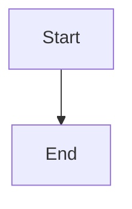

# Shadow 아키텍처 개선안 - Mermaid 다이어그램 모음

이 폴더에는 Shadow 프로젝트의 아키텍처 개선안을 시각화한 Mermaid 다이어그램들이 있습니다.

## 📊 다이어그램 목록

### 1. 현재 문제점 (`01-current-problems.mmd`)

**타입**: 플로우차트 (Graph TB)

**내용**:
- shadow-py의 main.py에 클라이언트+서버 로직이 혼재된 문제
- OS 의존적인 Recorder (mss, pynput, PyObjC)
- 3가지 주요 문제점:
  - ⚠️ 클라우드 배포 불가 (OS 의존성)
  - ⚠️ 역할 불명확 (녹화 vs API)
  - ⚠️ 의존성 비대화 (100MB+ 패키지)

**사용법**:
```bash
# Mermaid CLI로 이미지 생성
mmdc -i 01-current-problems.mmd -o 01-current-problems.png

# 또는 Mermaid Live Editor에서 열기
open https://mermaid.live
```

---

### 2. 추천 아키텍처 (`02-recommended-architecture.mmd`)

**타입**: 플로우차트 (Graph TB)

**내용**:
- **Option 1 (Tauri Desktop App)** 의 전체 구조
- 4개 레이어:
  - 💻 Desktop App (Tauri + shadow-web)
  - ☁️ Cloud Backend (FastAPI on Vercel)
  - 🗄️ Supabase (DB + Storage)
  - 💬 Integrations (Slack, Web Dashboard)
- 12단계 데이터 흐름 화살표

**주요 컴포넌트**:
- Next.js UI (shadow-web 재사용)
- Tauri Core (Rust)
- Vision AI (Claude Opus 4.5)
- Pattern Detection (LLM)
- HITL Generator
- Spec Builder

---

### 3. 데이터 흐름 시퀀스 (`03-data-flow.mmd`)

**타입**: 시퀀스 다이어그램 (sequenceDiagram)

**내용**:
- 전체 E2E 플로우:
  1. 사용자가 녹화 시작 (30초)
  2. Desktop에서 화면 캡처 + 입력 이벤트 수집
  3. 키프레임 추출 및 Storage 업로드
  4. FastAPI로 관찰 데이터 전송
  5. 백그라운드에서 Vision AI 분석
  6. 패턴 감지 및 HITL 질문 생성
  7. Slack으로 질문 전송
  8. 사용자 응답 수신
  9. 명세서 생성
  10. 결과 조회 (Desktop 또는 Web)

**참여자**:
- 👤 사용자
- 💻 Tauri Desktop
- 🗄️ Supabase Storage
- ☁️ FastAPI Backend
- 🗄️ PostgreSQL
- 💬 Slack

---

### 4. 4가지 옵션 비교 (`04-options-comparison.mmd`)

**타입**: 플로우차트 (Graph TB)

**내용**:
- **Option 1**: 🎯 Tauri Desktop App (추천)
- **Option 2**: ⚡ Electron + Next.js
- **Option 3**: 🌐 Chrome Extension
- **Option 4**: 🛠️ CLI Client

각 옵션별 장단점:
- ✅ 장점 (Pros)
- ⚠️ 단점 (Cons)

**비교 포인트**:
- 패키지 크기 (10MB ~ 150MB)
- 구현 난이도
- 사용자 경험
- 배포 방식

---

### 5. 구현 로드맵 (`05-implementation-roadmap.mmd`)

**타입**: 간트 차트 (gantt)

**내용**:
- **Phase 1**: 준비 (3일)
  - Tauri 환경 설정
  - shadow-web Tauri 통합
  - Rust Commands 스캐폴딩

- **Phase 2**: 녹화 기능 (4일)
  - 화면 캡처 구현 (Rust)
  - 입력 이벤트 수집
  - 키프레임 추출 로직

- **Phase 3**: 서버 통합 (3일)
  - Supabase Storage 업로드
  - FastAPI 엔드포인트 호출
  - 에러 핸들링

- **Phase 4**: UI 구현 (4일)
  - 녹화 컨트롤 UI
  - 세션 목록 뷰
  - 패턴 결과 뷰

- **Phase 5**: 테스트 & 배포 (4일)
  - E2E 테스트
  - 빌드 파이프라인
  - macOS/Windows 배포

**Milestones**:
- ✅ 프로토타입 완성 (Phase 2 후)
- ✅ 베타 릴리즈 (Phase 4 후)
- ✅ 1.0 릴리즈 (Phase 5 후)

**총 예상 시간: 18일 (약 3.5주)**

---

### 6. 핵심 개선 포인트 (`06-key-improvements.mmd`)

**타입**: 플로우차트 (Graph TB)

**내용**:
- **5가지 핵심 개선사항**:
  1. 역할 분리 (Desktop: 녹화, Cloud: 분석)
  2. 배포 가능 (FastAPI → Vercel)
  3. 사용자 경험 (GUI + 웹 대시보드)
  4. 확장성 (멀티 클라이언트 + DB)
  5. 보안 (API 키 서버 격리)

- **정량적 효과**:
  - 패키지 크기: 100MB → 10MB (90% 감소)
  - 메모리 사용: 300MB → 40MB (87% 감소)
  - 시작 시간: 2초 → 0.5초 (75% 개선)
  - 배포: ❌ → ✅ Vercel (100% 개선)

---

## 🛠️ Mermaid 도구 사용법

### 온라인 에디터

1. [Mermaid Live Editor](https://mermaid.live) 방문
2. `.mmd` 파일 내용을 복사해서 붙여넣기
3. 실시간으로 다이어그램 확인
4. PNG/SVG로 다운로드

### VS Code 확장

```bash
# Mermaid Preview 확장 설치
code --install-extension bierner.markdown-mermaid
```

`.mmd` 파일을 열고 `Ctrl+Shift+V` (또는 `Cmd+Shift+V`)로 프리뷰

### CLI 도구

```bash
# Mermaid CLI 설치
npm install -g @mermaid-js/mermaid-cli

# PNG 이미지 생성
mmdc -i 01-current-problems.mmd -o 01-current-problems.png

# SVG 생성 (벡터 이미지)
mmdc -i 02-recommended-architecture.mmd -o 02-recommended-architecture.svg

# 테마 적용
mmdc -i 03-data-flow.mmd -o 03-data-flow.png -t forest

# 모든 파일 일괄 변환
for file in *.mmd; do
  mmdc -i "$file" -o "${file%.mmd}.png"
done
```

### GitHub/GitLab 렌더링

GitHub와 GitLab은 Markdown 내 Mermaid를 자동으로 렌더링합니다:

````markdown

````

---

## 📁 파일 구조

```
docs/report/slack-bot/
├── README.md                              # 이 파일
├── 01-current-problems.mmd                # 현재 문제점
├── 02-recommended-architecture.mmd        # 추천 아키텍처
├── 03-data-flow.mmd                       # 데이터 흐름
├── 04-options-comparison.mmd              # 옵션 비교
├── 05-implementation-roadmap.mmd          # 구현 로드맵
├── 06-key-improvements.mmd                # 개선 효과
├── slack-bot.md                           # Slack Bot 호출 흐름
└── architecture-improvement-summary.md    # 전체 요약 문서
```

---

## 🔗 관련 문서

- **전체 요약**: [architecture-improvement-summary.md](./architecture-improvement-summary.md)
- **Slack Bot 분석**: [slack-bot.md](./slack-bot.md)
- **클라이언트-서버 분리 계획**: [../client-server-mixed/refactor-client-server.md](../client-server-mixed/refactor-client-server.md)
- **아키텍처 상세 분석**: [../client-server-mixed/architecture-analysis-and-improvement.md](../client-server-mixed/architecture-analysis-and-improvement.md)

---

## 📝 업데이트 이력

| 날짜 | 내용 | 작성자 |
|------|------|--------|
| 2026-02-04 | 초안 작성 (6개 다이어그램 분리) | Claude |
