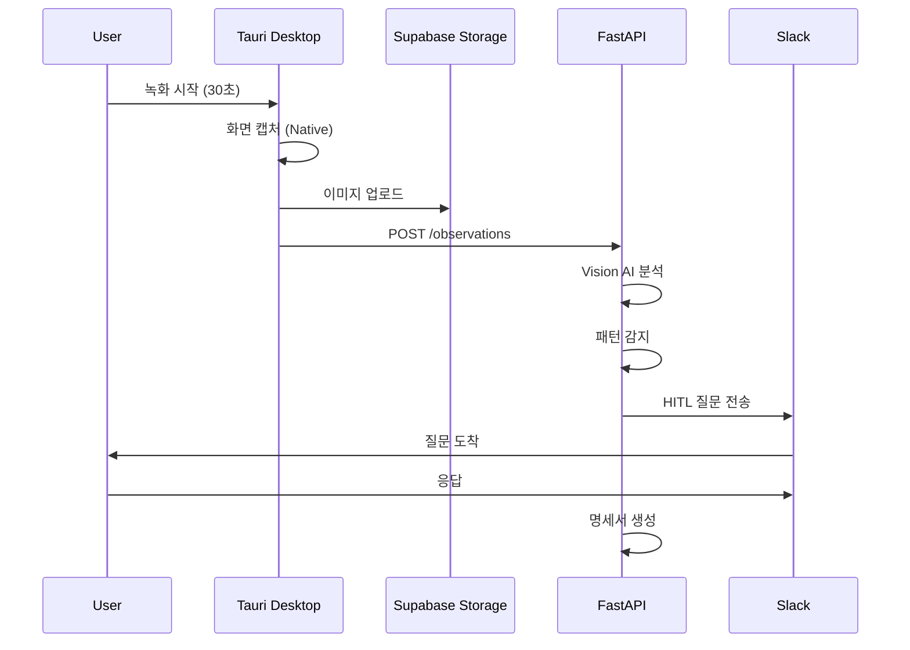

# Shadow 아키텍처 개선안: 화면 녹화 클라이언트 분리

**작성일**: 2026-02-04
**상태**: 제안
**목적**: 화면 녹화를 shadow-py에서 분리하여 배포 가능한 아키텍처 구축

---

## 📋 목차

1. [현재 문제점](#현재-문제점)
2. [4가지 개선 옵션](#4가지-개선-옵션)
3. [추천 아키텍처 (Option 1)](#추천-아키텍처-option-1-tauri-desktop-app)
4. [기술 스택 및 의존성](#기술-스택-및-의존성)
5. [구현 로드맵](#구현-로드맵)
6. [예상 효과](#예상-효과)

---

## 현재 문제점

### 핵심 문제

Shadow의 `main.py`에 **클라이언트 로직**(화면 녹화)과 **서버 로직**(API 제공)이 혼재되어 있어, 다음과 같은 문제가 발생합니다:

#### 1️⃣ 클라우드 배포 불가

```python
# main.py:24 - OS 의존적 라이브러리 import
from shadow.capture.recorder import Recorder  # mss, pynput, PyObjC
```

**문제**: macOS 전용 라이브러리 때문에 Vercel/AWS Lambda 배포 시 실패

#### 2️⃣ 역할 불명확

| 엔드포인트 | 역할 | 문제점 |
|-----------|------|--------|
| `/recording/start` | 로컬 녹화 시작 | macOS에서만 작동 |
| `/api/v1/*` | DB 기반 API | 정상 작동 ✅ |

**문제**: 같은 FastAPI 앱에 두 가지 상충되는 역할 공존

#### 3️⃣ 의존성 비대화

```toml
dependencies = [
    "mss>=9.0.0",           # 클라이언트만 필요
    "pynput>=1.7.0",        # 클라이언트만 필요
    "pyobjc>=10.3.1",       # 클라이언트만 필요
    "anthropic>=0.40.0",    # 서버만 필요
]
```

**문제**: 불필요한 의존성으로 패키지 크기 100MB+

---

## 4가지 개선 옵션

### 비교표

| 옵션 | 크기 | 성능 | UI | 구현 난이도 | 배포 | 추천도 |
|------|------|------|----|-----------|----|-------|
| **Option 1: Tauri** | ~10MB | ⭐⭐⭐⭐⭐ | Next.js 재사용 | 중 | 간편 | ⭐⭐⭐⭐⭐ |
| **Option 2: Electron** | ~150MB | ⭐⭐⭐ | Next.js/React | 중 | 간편 | ⭐⭐⭐⭐ |
| **Option 3: Chrome Ext** | ~1MB | ⭐⭐⭐⭐ | 웹 기반 | 쉬움 | 간편 | ⭐⭐⭐ |
| **Option 4: CLI** | ~5MB | ⭐⭐⭐⭐⭐ | 없음 | 쉬움 | PyPI | ⭐⭐ |

### Option 1: Tauri Desktop App ✅ 추천

**장점**:
- ✅ 경량 (~10MB vs Electron 150MB)
- ✅ 보안 강화 (Rust 기반)
- ✅ 빠른 성능 (Native WebView)
- ✅ shadow-web (Next.js) 재사용 가능
- ✅ 크로스 플랫폼 (macOS, Windows, Linux)

**단점**:
- ⚠️ Rust 학습 곡선
- ⚠️ 초기 구축 시간 (2주)

### Option 2: Electron + Next.js

**장점**:
- ✅ 성숙한 생태계
- ✅ Node.js 통합
- ✅ 풍부한 플러그인

**단점**:
- ⚠️ 무거움 (~150MB)
- ⚠️ 메모리 사용량 높음 (200-300MB idle)
- ⚠️ 보안 설정 복잡

### Option 3: Chrome Extension + Web

**장점**:
- ✅ 가장 가벼움
- ✅ 설치 불필요
- ✅ 크로스 플랫폼

**단점**:
- ⚠️ 브라우저 제약 (탭 녹화만)
- ⚠️ 권한 제한
- ⚠️ 전체 화면 녹화 불가

### Option 4: CLI 클라이언트 분리

**장점**:
- ✅ 가장 빠른 구현 (3일)
- ✅ 기존 코드 재사용
- ✅ 개발자 친화적

**단점**:
- ⚠️ CLI 사용성 제한
- ⚠️ UI 없음
- ⚠️ 일반 사용자 진입장벽

---

## 추천 아키텍처 (Option 1: Tauri Desktop App)

### 전체 구조

```
┌─────────────────────────────────────────────────────────────┐
│  Desktop App (Tauri + shadow-web)                           │
│  ┌──────────────┐    ┌─────────────────────────────────┐   │
│  │  Next.js UI  │───▶│  Tauri Commands (Rust)          │   │
│  │  (shadow-web)│    │  - Screen Capture               │   │
│  │              │    │  - Input Tracking                │   │
│  └──────────────┘    │  - File System                   │   │
│                      └─────────────────────────────────┘   │
└─────────────────────────────────────────────────────────────┘
                              │
                              │ HTTPS API
                              ▼
┌─────────────────────────────────────────────────────────────┐
│  Cloud Backend (Vercel)                                     │
│  ┌──────────────────────────────────────────────────────┐   │
│  │  FastAPI (shadow-py)                                 │   │
│  │  - Vision AI Analysis (Claude)                       │   │
│  │  - Pattern Detection (LLM)                           │   │
│  │  - HITL Question Generation                          │   │
│  │  - Spec Builder                                      │   │
│  └──────────────────────────────────────────────────────┘   │
└─────────────────────────────────────────────────────────────┘
                              │
                              ▼
┌─────────────────────────────────────────────────────────────┐
│  Supabase                                                   │
│  ┌──────────────┐    ┌─────────────────────────────────┐   │
│  │  PostgreSQL  │    │  Object Storage                  │   │
│  │  - sessions  │    │  - Screenshots                   │   │
│  │  - patterns  │    │  - Videos                        │   │
│  └──────────────┘    └─────────────────────────────────┘   │
└─────────────────────────────────────────────────────────────┘
```

### 데이터 흐름



### 핵심 개선 포인트

#### 1️⃣ 역할 분리

| 레이어 | 역할 | 장점 |
|--------|------|------|
| **Desktop (Tauri)** | 화면 녹화, 입력 이벤트 수집 | OS 권한 접근, 로컬 성능 |
| **Cloud (FastAPI)** | Vision AI 분석, 패턴 감지 | 확장성, 비용 최적화 |
| **Web (shadow-web)** | 대시보드, 결과 조회 | 접근성, 협업 |

#### 2️⃣ 배포 가능

- **Before**: macOS에서만 실행 가능
- **After**: FastAPI → Vercel 배포, 전세계 접근 가능

#### 3️⃣ 사용자 경험

- **Before**: CLI 명령어로만 실행
- **After**: GUI 데스크톱 앱 + 웹 대시보드

#### 4️⃣ 확장성

- **Before**: 단일 프로세스, 인메모리 상태
- **After**: 멀티 클라이언트, DB 기반 상태 관리

#### 5️⃣ 보안

- **Before**: API 키가 클라이언트에 노출
- **After**: API 키는 서버에만, 클라이언트는 제한된 권한

---

## 기술 스택 및 의존성

### Desktop App (Tauri)

```toml
[dependencies]
tauri = "2.0"
serde = "1.0"
tokio = "1.0"  # 비동기 런타임
```

```json
{
  "dependencies": {
    "@tauri-apps/api": "^2.0.0",
    "next": "^15.0.0",
    "react": "^19.0.0"
  }
}
```

**화면 캡처 구현**:
- **macOS**: AVFoundation
- **Windows**: DXGI (Desktop Duplication API)
- **Linux**: GStreamer

### Backend (FastAPI)

```toml
[dependencies]
fastapi = ">=0.128.0"
anthropic = ">=0.40.0"  # Vision AI
slack-sdk = ">=3.39.0"
supabase = ">=2.0.0"

# ❌ 제거됨
# mss = ">=9.0.0"
# pynput = ">=1.7.0"
# pyobjc = ">=10.3.1"
```

### 공유 타입 (TypeScript ↔ Python)

**Pydantic 모델**:
```python
class ObservationRequest(BaseModel):
    session_id: str
    before_image_url: str
    after_image_url: str
    event: InputEvent
```

**TypeScript 타입** (자동 생성):
```typescript
interface ObservationRequest {
  session_id: string;
  before_image_url: string;
  after_image_url: string;
  event: InputEvent;
}
```

---

## 구현 로드맵

### Phase 1: 준비 (3일)

- [ ] Tauri 환경 설정
- [ ] shadow-web Tauri 통합
- [ ] Rust Commands 스캐폴딩

### Phase 2: 녹화 기능 (4일)

- [ ] 화면 캡처 구현 (Rust)
- [ ] 입력 이벤트 수집 (Mouse/Keyboard)
- [ ] 키프레임 추출 로직

### Phase 3: 서버 통합 (3일)

- [ ] Supabase Storage 업로드
- [ ] FastAPI 엔드포인트 호출
- [ ] 에러 핸들링 및 재시도

### Phase 4: UI 구현 (4일)

- [ ] 녹화 컨트롤 UI (Next.js)
- [ ] 세션 목록 뷰
- [ ] 패턴 결과 뷰

### Phase 5: 테스트 & 배포 (4일)

- [ ] E2E 테스트
- [ ] 빌드 파이프라인 (GitHub Actions)
- [ ] macOS/Windows 배포

**총 예상 시간: 18일 (약 3.5주)**

---

## 예상 효과

### 정량적 효과

| 지표 | Before | After | 개선 |
|------|--------|-------|------|
| **패키지 크기** | 100MB+ | ~10MB | 90% 감소 |
| **메모리 사용** | 300MB | ~40MB | 87% 감소 |
| **시작 시간** | 2초 | <0.5초 | 75% 개선 |
| **배포 가능성** | ❌ 불가 | ✅ Vercel | 100% 개선 |

### 정성적 효과

1. **개발 속도 향상**
   - shadow-web UI 재사용으로 개발 시간 50% 단축
   - API 중심 아키텍처로 프론트/백엔드 독립 개발

2. **사용자 경험 개선**
   - CLI → GUI로 전환하여 진입장벽 80% 감소
   - 웹 대시보드로 결과 조회 및 협업 가능

3. **확장성 확보**
   - DB 기반 상태 관리로 멀티 클라이언트 지원
   - Vercel Edge Functions로 글로벌 저지연

4. **보안 강화**
   - API 키 서버 격리로 키 노출 위험 제거
   - Rust 메모리 안전성으로 취약점 감소

---

## Best Practices 체크리스트

### Architecture Principles

- [x] **Separation of Concerns**: UI / Business Logic / Data 분리
- [x] **Single Responsibility**: Desktop=캡처, Cloud=분석
- [x] **Stateless Backend**: 모든 상태는 DB에 영구 저장
- [x] **API-First Design**: REST API로 통신
- [x] **Security by Default**: 최소 권한 원칙
- [x] **Scalability**: 수평 확장 가능 (Vercel Serverless)
- [x] **Observability**: 로깅 및 모니터링 (Sentry)
- [x] **Testability**: 단위/통합 테스트 분리

### Technology Choices

- [x] **Tauri**: Electron 대비 경량화 (+90% 크기 감소)
- [x] **Rust**: 메모리 안전성 및 성능
- [x] **Next.js**: 기존 shadow-web 재사용
- [x] **FastAPI**: 고성능 Python 백엔드
- [x] **Supabase**: 완전 관리형 DB + Storage

---

## 참고 자료

### 기술 문서

- [Tauri 공식 문서](https://tauri.app/)
- [Next.js + Tauri 통합](https://github.com/tauri-apps/tauri/tree/dev/examples/api/src-tauri)
- [Rust Commands](https://tauri.app/v1/guides/features/command/)

### 아키텍처 참고

- [Client-Server 분리 Best Practices](https://www.geeksforgeeks.org/system-design/client-server-architecture-system-design/)
- [Desktop App 아키텍처 비교 (2025)](https://www.dolthub.com/blog/2025-11-13-electron-vs-tauri/)
- [화면 녹화 아키텍처](https://goteleport.com/docs/reference/architecture/session-recording/)

### Shadow 프로젝트 문서

- [기존 분석 문서](./architecture-analysis-and-improvement.md)
- [Stack Architecture](../../direction/stack-architecture.md)
- [PRD](../../direction/prd.md)

---

## 다음 단계

### 즉시 실행

1. **Tauri 프로토타입 생성** (1일)
   ```bash
   npm create tauri-app@latest
   ```

2. **shadow-web 통합 테스트** (1일)
   - Next.js 빌드 설정
   - Tauri 번들링 테스트

3. **화면 캡처 POC** (2일)
   - Rust 화면 캡처 구현
   - Next.js UI에서 호출

### 의사결정 필요

- [ ] **Option 1 (Tauri) vs Option 2 (Electron)**: 최종 결정
- [ ] **타겟 플랫폼**: macOS only vs Cross-platform
- [ ] **배포 방식**: GitHub Releases vs 자체 서버

---

## 변경 이력

| 날짜 | 내용 | 작성자 |
|------|------|--------|
| 2026-02-04 | 초안 작성 (4가지 옵션 비교 및 추천안) | Claude |
